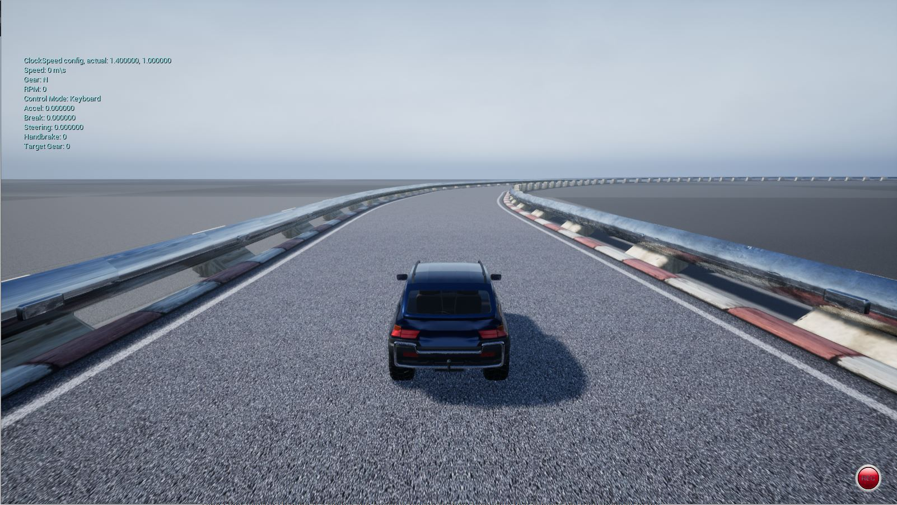

# Deep Reinforcement Learning for Autonomous Driving 

<!---THIS DOCUMENT IS A WORK-IN-PROGRESS--->

## About the Project
--------------
This research investigation aims to study Deep Supervised Learning and Deep Reinforcement Learning in the context of Autonomous Driving and add advancements towards solving level 5 autonomy for self driving in a real-world setting. Concretely, we study a Deep Learning (DL) technique called Behavioral Cloning (BC). The goal is to further optimize the vanilla BC model through data augmentation, as well as neural network architecture design and hyperparameter tuning. We then investigate three Deep Reinforcement Learning algorithms, Deep Q-Networks (DQN), Advantage Actor-Critic (A2C), and Proximal Policy Optimization(PPO). We implement the DQN algorithm from scratch and use this algorithm as a baseline to study the effects of different reward function strategies, spawn location design, and Neural Network model architecture on the performance of the DRL agents. Once we have determined a robust DRL framework, we compare the performance of Deep Q-Networks (DQN), Advantage Actor-Critic (A2C), and Proximal Policy Optimization(PPO), where the A2C and PPO models are trained using the baselines implementation from OpenAI. Finally, we compare the best DSL-based and DRL-based autonomous vehicle controllers measured in an unseen race track environment.

<!-- We use the [Airsim](https://microsoft.github.io/AirSim/) autonomous driving simulator and developed three custom race track environments to train our DRL-based controllers. -->

A detailed research dissertation can be found [here](doc/Accelerating_Training_of_DeepRL_Based_AV_Agents_Through_Env_Designs.pdf).

<!-- Video of results:

<p align="center">
  <a href="http://www.youtube.com/watch?feature=player_embedded&v=iF502iJKTIY" target="_blank">
    
  </a>
</p> -->

<!-- Use the timestamps in the description to navigate to the experiments of your interest. -->


<p align="center">
  
</p>

<!-- [](https://github.com/ByronDev121/DQN-Hind-Sight-Reward-Shaping/) -->


## Contributions
--------------
- We propose and implement an OpenAI Gym Specification Application Programming Interface (API) for AirSim\cite{shah2018airsim} in Python, to train and test vision-based DSL and DRL agents. This implementation allows for rapid reward function design to accelerate the training and testing of different reward strategies. We also design and implement three custom race track environments to train and test DSL and DRL agents. *While some third-party libraries exist, none are officially supported by OpenAI, and none are flexible enough to support rapid testing and development of both DSL and DRL models.
  
- We optimize a Deep Supervised Learning approach known as "Behavioral Cloning" for autonomous vehicle control through data augmentation, Neural Network structure design, and hyper-parameter tuning.
    
- Using the results of this research, we propose a novel data augmentation design for DSL models trained in a race track environment and showcase the effectiveness of data augmentation when training a DSL-based autonomous vehicle controller.
    
- We optimize end-to-end Deep Reinforcement Learning for autonomous vehicle control through reward function design, reset/spawn location design, and Neural Network structure design.
   
- We propose a novel optimized reward function design for DRL agents trained in a race track environment based on the experimental analysis results in this research and show the performance impact on DRL-based autonomous vehicle controllers that are trained using poorly designed reward functions. This is a continuation of our published work [Hindsight Reward Shaping for Deep Reinforcement Learning](https://github.com/ByronDev121/DQN-Hind-Sight-Reward-Shaping/).
   
- We provide a comparative study of the state-of-the-art Value Function Approximation, Policy Gradient, and Actor-Critic DRL algorithms in the context of autonomous vehicle control.
   
- We provide a comparative study of controllers developed using both optimized DSL and DRL approaches and highlight the advantages and disadvantages of each technique. We also highlight potential areas where this research can be continued.


We ultimately exploit our findings to develop a robust autonomous vehicle controller using optimized Deep Reinforcement Learning, which yields impressive autonomy performance when deployed in an unseen race track environment.


## Building AirSim
--------------
This project uses Microsoft's AirSim simulator for drones, cars and more, built on Unreal Engine. Follow the build instructions [here](https://microsoft.github.io/AirSim/).

## Setting up development environment
--------------
To install all dependecies required for this project there is a requirements.txt file included in the repository. Simply create a new enviroment in anaconda or what ever container manager you are using and run the following command:

```bash
pip install -r requirements.txt 
```

## Creating custom track in Unreal Engine
--------------
To create your own track I suggest following [this](https://www.youtube.com/watch?v=wR0fH6O9jD8) tutorial. When you have built your track, add it into your AirSim project and build from source. 

I found these quite helpfull:

https://microsoft.github.io/AirSim/docs/unreal_custenv/

https://www.youtube.com/watch?v=1oY8Qu5maQQ&feature=youtu.be

## Usage
--------------
### Prerequisites

- [Python](https://docs.python.org/3/) version 3.6
- [Airsim](https://github.com/carla-simulator/carla/tree/0.9.5) version 1.2.3
- [TensorFlow for GPU](https://www.tensorflow.org/) version 1.13.1
- [OpenAI gym](https://github.com/openai/gym) version 0.12.0
- [OpenCV for Python](https://pypi.org/project/opencv-python/) version 4.1.1
- A GPU with at least 4 GB VRAM (we used a GeForce RTX 2060)


### Open Track in AirSim
Open the airsim application with you track. e.g. (Open the working directory of your AirSim executable on a windows machine)
```bash
AirSim.exe Track_Three -windowed
```

### Train Model
From the project's directory execute training code in your Anaconda environment
```bash
~(deep_rl)>python3 main.py
```

### Run Model
From the project's directory execute training code in your Anaconda environment (remember)
```bash
~(deep_rl)>python3 load_and_run.py
```

<!-- Conference Paper
------
This research has been publish under IEEE. Find the paper here. 

Video Results
------
The video result can be found [here](https://www.youtube.com/watch?v=dJN05nHdvpE&t=311s) -->


# Future Work

Here are a couple of ideas of how our work can be expanded or improved on:

- Extending the techniques studied in this research paper to control the vehicles steering, throttle and braking.
- Pre-training Neural Network models used in DRL applications to increase the stability and speed up training.
- Multi-agent training, or adding other bot-vehicles in the environment during training.
- Making the agent adhere to specific traffic rules
- Finally, train and test controllers developed in this research in on a physical vehicle acting in the real-life environment and evaluated their real-world performance. 

<!-- # Cite this Project

```
@mastersthesis{, title={Advancing Deep Reinforcement Learning for Vision-Based Autonomous Vehicle Control}, url={}, school={University of Johannesburg}, publisher={University of Johannesburg}, author={Byron de Villiers}, year={2022}, month={Sep}}
``` -->

# License
-------

The code in this repository is distributed under the MIT License.